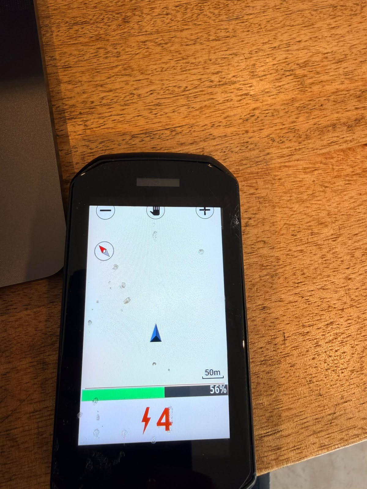

# Stark Varg → Garmin bridge

Show your **Stark Varg**'s battery % and ride mode live on a **Garmin Edge** bike computer.

An Android app runs on the bike's own "Stark phone", reads the bike's Bluetooth (BLE) telemetry,
and relays it to a small Connect IQ data field on the Garmin — no extra hardware required.



_Battery as a fuel-gauge bar (green → red by charge); ride mode big and colour-coded by number (green → red)._

> ⚠️ **Unofficial / not affiliated with Stark Future.** Reverse-engineered, read-only telemetry.
> Use at your own risk. See the [disclaimer](#disclaimer).

---

## What it does

- Reads **battery state-of-charge (%)** and the active **ride mode / power map** from the bike over BLE.
- Displays them on a Garmin Edge data field you can drop onto any data screen.
- Runs *alongside* the stock Stark app — it doesn't disconnect it (see [piggyback](#how-it-works)).

Tested on an **Edge 1050**; should work on any Connect IQ 3.1+ Edge (530/830/1030+/1040/1050).

---

## Architecture

```
  ┌──────────────┐   BLE (custom GATT,     ┌────────────────────────┐   BLE (custom svc,     ┌─────────────┐
  │  Stark Varg  │   "Stark Future" UUIDs) │   Stark phone (app)     │   NOTIFY, ≤20B pkt)    │   Garmin    │
  │     VCU      │ ──────────────────────► │  ① BLE CENTRAL          │ ─────────────────────► │  Edge       │
  │ (peripheral) │   subscribe to notify   │     read + decode       │                        │  (CIQ data  │
  │  ONE conn    │   • SOC   00006004-…    │  ② BLE PERIPHERAL       │                        │   field)    │
  │  only        │   • map   00002004-…    │     re-advertise        │                        │  renders    │
  └──────────────┘                         └────────────────────────┘                        │ "89% ⚡3"   │
         stock Stark app stays connected ─────────┘                                           └─────────────┘
```

Two components:

| Folder | What it is |
|---|---|
| [`android-bridge/`](android-bridge/) | Kotlin app for the Stark phone: BLE central (reads the bike) + BLE peripheral (advertises to the Garmin). |
| [`garmin-datafield/`](garmin-datafield/) | Connect IQ (Monkey C) data field: BLE central that subscribes to the phone and renders battery % + mode. |
| [`ble-peripheral-probe/`](ble-peripheral-probe/) | Throwaway diagnostic app that checks whether a phone can act as a BLE peripheral. |

The wire format between the two apps is documented in [`PROTOCOL.md`](PROTOCOL.md).

---

## How it works

- **Piggyback read.** The Varg's VCU only serves **one** BLE connection at a time, normally held by the
  stock Stark app. On Android, all apps share that single link, so the bridge attaches a *second* GATT
  client to the already-connected, already-bonded bike and reads telemetry **without** kicking the stock
  app off. (`BikeClient.tryDirectConnect()`.)
- **Decode.** Battery/mode are decoded from the bike's proprietary GATT characteristics — see
  [`PROTOCOL.md`](PROTOCOL.md). This builds on the reverse-engineering in the
  [svag](https://github.com/b1naryth1ef/svag-mini) project (credit below).
- **Re-advertise.** The phone runs a GATT server + advertiser exposing a tiny custom service; the Garmin
  connects as a BLE central and subscribes.

### ⚠️ The non-obvious gotcha: you need the bond, but *not* the connection

Two rules, both learned the hard way. You need **both**, and they pull in opposite directions:

1. **The Edge must be Bluetooth-bonded to the phone**, or the Connect IQ scanner will never *discover*
   it — it'll scan forever and never match. Create the bond by pairing the Stark phone to the Edge in
   the **Garmin Connect** app, once.
   *(An iPhone / nRF Connect sees the advert with no bond at all, which makes this maddening to debug.)*
2. **Garmin Connect must not be actively connected**, or the field can't *connect*. It will find the
   phone (match) but the connection hangs and never completes — because the Edge already holds a link
   to that phone via Garmin Connect, and Connect IQ can't open its own connection alongside it.

**So: pair once to create the bond, then disable (or force-stop) Garmin Connect on the Stark phone.**
The bond survives the app being disabled — and the field then both discovers *and* connects.

Symptom cheat-sheet:

| Field shows | Meaning | Fix |
|---|---|---|
| `SCAN` forever, never matches | Not bonded | Pair to the Edge in Garmin Connect |
| Matches but never connects (stuck) | Garmin Connect is live | Force-stop / disable Garmin Connect |

---

## Build & install

Both sides have a one-command build script (macOS; needs Android Studio for the phone side and the
Connect IQ SDK for the Garmin side).

**Phone app:**
```bash
cd android-bridge
./build-android.sh install     # builds + installs to a USB-connected phone (omit 'install' to just build)
```

**Garmin data field:**
```bash
cd garmin-datafield
./build-garmin.sh edge1050      # swap in your Edge model
# then copy bin/StarkBridge.prg onto the Edge's GARMIN/Apps/ folder and power-cycle
```
> The Connect IQ build needs a developer signing key (`garmin-datafield/developer_key`). One is generated
> automatically by the build script on first run. **It is git-ignored — keep it private.**

---

## Usage

1. Install both apps (above). On the phone, open **Stark Bridge**, enter your bike's **VIN**, tap **Start**.
2. **Pair the phone to the Edge in Garmin Connect** (one-time — this creates the required bond).
3. **Disable / force-stop Garmin Connect on the phone** — a live Garmin Connect link blocks the data
   field from connecting (see the [gotcha](#️-the-non-obvious-gotcha-you-need-the-bond-but-not-the-connection)).
   The bond stays put.
4. On the Edge: Data Screens → add field → Connect IQ → **Stark Varg Bridge**.

> **Tip:** your bike's VIN is its Bluetooth name. If you're unsure of it, read it off the phone's bonded
> device list (`adb shell dumpsys bluetooth_manager | grep -A3 "Bonded devices"`) rather than from
> memory — mixing up VINs between bikes just fails silently.

Battery % and ride mode appear and update live. Calibration notes (SOC scaling, mode indices) are in
[`CALIBRATION-CHECKLIST.md`](CALIBRATION-CHECKLIST.md).

---

## Roadmap

- **ANT+ LEV output** for driving **multiple** Edges reliably. ANT+ is a broadcast (one-to-many), so any
  number of head units can listen with no per-device connections, and the Edge shows *native* e-bike
  fields. Needs a USB-OTG ANT dongle on the phone.

---

## Credits

- BLE reverse-engineering of the Stark Varg builds on **[b1naryth1ef/svag-mini](https://github.com/b1naryth1ef/svag-mini)** — thank you.
- Android dual-role bridge pattern inspired by **[Soarcer/bosch-garmin-bridge](https://github.com/Soarcer/bosch-garmin-bridge)**.

## Disclaimer

This project is **not affiliated with, endorsed by, or supported by Stark Future or Garmin.** It reads
telemetry only (it does not write to or control the bike), but it is unofficial and reverse-engineered:
it may stop working after a firmware update, and using it could affect your warranty. Interact with your
bike's telemetry at your own risk, and never operate a display while riding in a way that distracts you.

## License

[MIT](LICENSE) © 2026 Tony Silva
